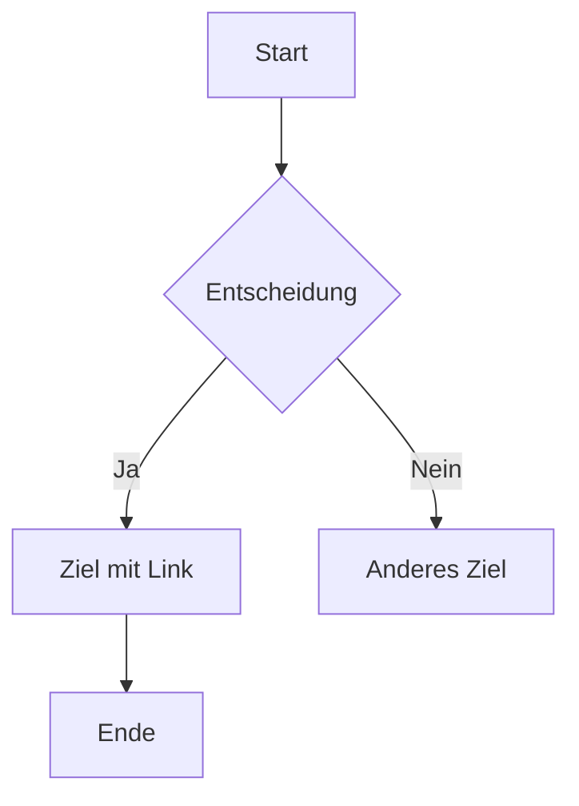

<p align="center">
  
</p>

# Minishell [Project](doc/PDF/minishell_subject.pdf)

## Über das Projekt
Minishell ist ein Projekt der 42 Coding School, das darauf abzielt, eine einfache Shell zu implementieren. Dieses Projekt hilft den Studenten, ein tieferes Verständnis für die Funktionsweise einer Shell und die Systemaufrufe zu entwickeln, die für die Ausführung von Befehlen erforderlich sind. Die Minishell unterstützt grundlegende Shell-Funktionen wie das Ausführen von Befehlen, das Arbeiten mit Umgebungsvariablen und einfache Pipelines.

## Voraussetzungen
Um dieses Projekt zu kompilieren und auszuführen, benötigen Sie:
- Ein UNIX-basiertes Betriebssystem (Linux, macOS, etc.)
- GCC (GNU Compiler Collection)
- Make

## Installation
1. Klonen Sie das Repository:
   ```sh
   git clone https://github.com/ihr-benutzername/minishell.git
   ```
2. Navigieren Sie in das Projektverzeichnis:
   ```sh
   cd minishell
   ```
3. Kompilieren Sie das Projekt mit `make`:
   ```sh
   make re
   ```

## Verwendung
Nach der erfolgreichen Kompilierung können Sie die Minishell starten, indem Sie den folgenden Befehl ausführen:
```sh
./minishell
```
Jetzt können Sie Befehle wie in einer normalen Shell eingeben.

Beispiel:

<p align="center">
  
</p>


## Funktionen
Minishell unterstützt die folgenden Funktionen:
- Ausführen von Binärdateien aus `PATH`, wie `ls`, `echo`, `cat` usw.
- Eingebaute Shell-Befehle wie `cd`, `pwd`, `export`, `unset`, `env` und `exit`
- Pipe-Handling (z.B. `ls -l | grep minishell`)
- Umgebungsvariablen

## Programmaufbau 




