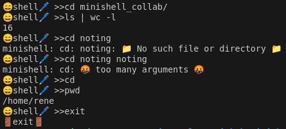
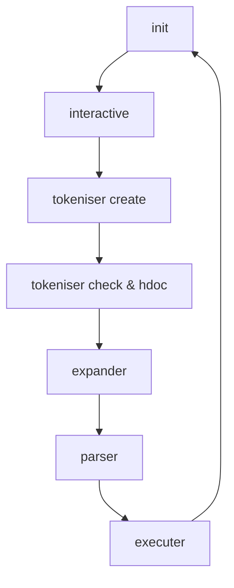
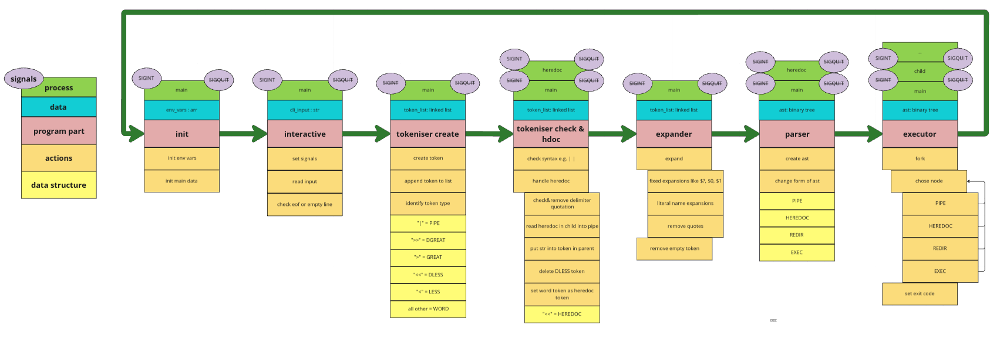

<p align="center">
  
</p>

# Minishell [Project](doc/PDF/minishell_subject.pdf)

## About the Project
MiniShell will introduce you to the world of shells, which provide a convenient text interface for interacting with your system. While shells may seem straightforward, they exhibit very specific and defined behavior in almost every situation, most of which must be handled correctly.

## Prerequisites
To compile and run this project, you need:
- A UNIX-based operating system (Linux, macOS, etc.)
- GCC (GNU Compiler Collection)
- Make

## Installation
1. Clone the repository:
   ```sh
   git clone https://github.com//ELREKO/minishell.git
   ```
2. Navigate to the project directory:
   ```sh
   cd minishell
   ```
3. Compile the project with `make`:
   ```sh
   make re
   ```

## Usage
After successful compilation, you can start the Minishell by executing the following command:
```sh
./minishell
```
Now you can enter commands as you would in a normal shell.

Example:

<p align="center">
  
</p>

## Features
Minishell supports the following features:
- Executing binaries from `PATH`, such as `ls`, `echo`, `cat`, etc.
- Built-in shell commands like `cd`, `pwd`, `export`, `unset`, `env`, and `exit`
- Pipe handling (e.g., `ls -l | grep minishell`)
- Environment variables

## Program Structure





### Modules 
- [init](doc/markdownfile_pic/init.md)
- [interactive](doc/markdownfile_pic/interactiv.md)
- [tokeniser create](doc/markdownfile_pic/tokeniser_create.md)
- [tokeniser check & hdoc](doc/markdownfile_pic/tokeniser_check.md)
- [expander](doc/markdownfile_pic/expander.md)
- [parser](doc/markdownfile_pic/parser.md)
- [executer](doc/markdownfile_pic/executer.md)
